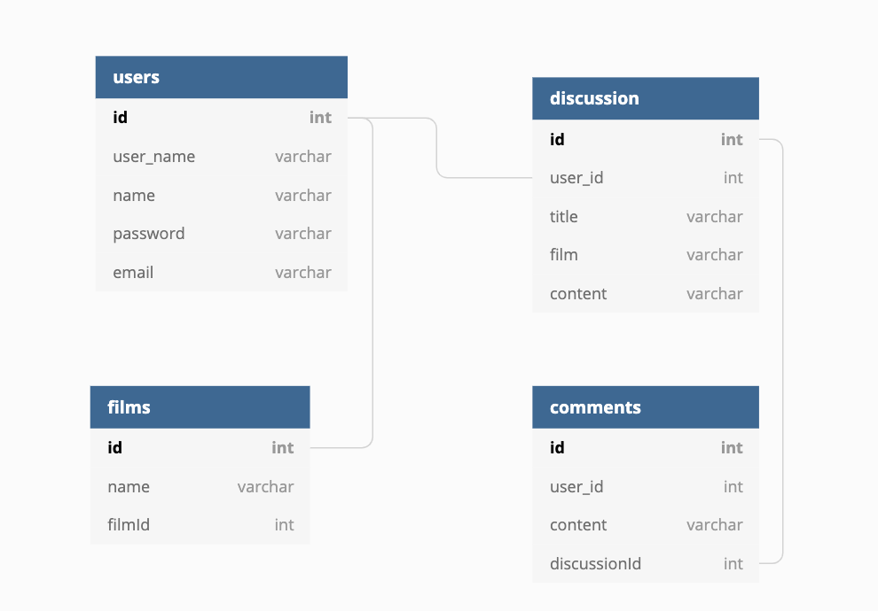
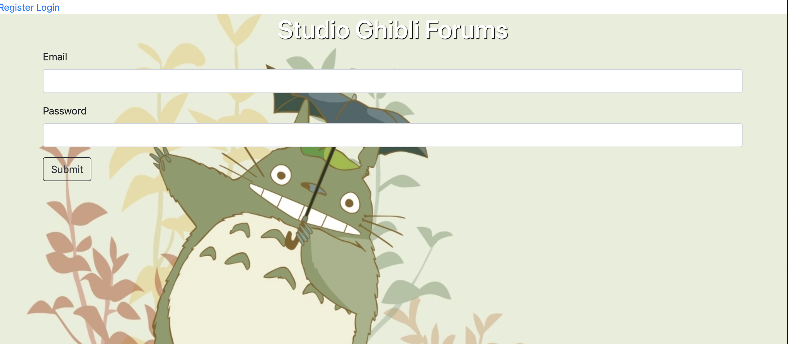

# Studio Ghibli Forums
## Link to the site: https://ghiblifilmp2.herokuapp.com/
-The purpose of the Studio Ghibli Forums is to provide a place to for the enthusiasts of Studio Ghibli to list their favorite of the films and create discussions about said films.

- Old screenshots of the website, most pages look drastically different.

- When I originally had the idea to create this site I imagined having a site where users would be able to select their favorite films, start a discussion and comment on other users posts. Due to a misunderstanding of the technologies used, I spent a lot of time going back to change the database models that I had set up to be able to accomplish the tasks that I wanted to within my site. As it stands the website is missing the ablility to view who posted what discussion and or comment.
## Strech Goals/ What's planned to be added:
- When I return to this project the first things that I will fix are thus: Some routes redirect the user to places on the site that don't make for the greatest user experience. If this site were to become used by any number of people other than myself and family then it would make sense to add upvote/downvote buttons so that discussions/comments can be listed in order of popularity. Then lastly I would impliment the ability to view other users profile pages so that they may see what others users have posted and what their favorites are.
### Studio Ghibli API: https://ghibliapi.herokuapp.com/
-All backgrounds taken from: https://wallpapersafari.com/ghibli-wallpapers/
-Technologies used: Node Axios,BCrypt,Express, EJS, Express EJS Layouts, Express sessions, Helmet, Method-Override,Passport,Nodemon,Morgan,Sequelize
